```mermaid
flowchart TD
    A[Start] --> B[Price of 1 notebook = 80]
    B --> C[Calculate total = 80 × 7 = 560]
    C --> D[Available money = 600]
    D --> E{Is 600 >= 560?}
    E -->|Yes| F[Print: You have enough money]
    E -->|No| G[Print: You don't have enough money]
    F --> H[End]
    G --> H[End]
```

                                                  📘 Python Basics Practice


This project demonstrates **Python fundamentals** including variables, data types, operators, conditions, and real-life examples. Each step explains **what the code does** and shows the **output** so beginners can easily follow along.  

“Here is the link to the Colab file. You can review the code there and run it to see the actual output and behavior":
https://colab.research.google.com/drive/137fwVdRFi4WhY4Ha5FjL8NQKUT8Ob7cn#scrollTo=WNYfSzYyMFQ2

---

## 📑 Table of Contents  

- [Q1: Variables & Data Types](#q1-variables--data-types)  
- [Q2: Arithmetic Operators](#q2-arithmetic-operators)  
- [Q3: Assignment Operators](#q3-assignment-operators)  
- [Q4: Comparison Operators](#q4-comparison-operators)  
- [Q5: Logical Operators](#q5-logical-operators)  
- [Q6: Real-Life Example](#q6-real-life-example)  
- [Q7: Bonus (User Input Example)](#q7-bonus-user-input-example)  
- [✅ Summary](#-summary)  

---

## Q1: Variables & Data Types  

**Description:**  
We create variables to store information and use `type()` to check their data types.  

```python
name = "Imam Sanghaar Chandio"  
age = 17  
is_student = True  

print(name, age, is_student)

# Data Types
print(type(name))      # str (string)
print(type(age))       # int (integer)
print(type(is_student))# bool (boolean)
```

**Output:**  
```
Imam Sanghaar Chandio 17 True
<class 'str'>
<class 'int'>
<class 'bool'>
```

---

## Q2: Arithmetic Operators  

**Description:**  
We perform math operations on two numbers (`x = 20`, `y = 6`).  

```python
x = 20
y = 6

print("Addition:", x + y)
print("Subtraction:", x - y)
print("Multiplication:", x * y)
print("Division:", x / y)
print("Floor Division:", x // y)
print("Modulus:", x % y)
print("Exponentiation:", x ** y)
```

**Output:**  
```
Addition: 26
Subtraction: 14
Multiplication: 120
Division: 3.3333333333333335
Floor Division: 3
Modulus: 2
Exponentiation: 64000000
```

---

## Q3: Assignment Operators  

**Description:**  
We update a variable step by step using assignment operators.  

```python
num = 10
print("Initial value:", num)

num += 5
print("After += 5:", num)

num *= 2
print("After *= 2:", num)

num -= 4
print("After -= 4:", num)

print("Final Value:", num)
```

**Output:**  
```
Initial value: 10
After += 5: 15
After *= 2: 30
After -= 4: 26
Final Value: 26
```

---

## Q4: Comparison Operators  

**Description:**  
We compare two numbers (`a = 15`, `b = 12`).  

```python
a = 15
b = 12

print(a > b)   # True
print(a < b)   # False
print(a == b)  # False
print(a != b)  # True
print(a >= b)  # True
print(a <= b)  # False
```

**Output:**  
```
True
False
False
True
True
False
```

---

## Q5: Logical Operators  

**Description:**  
We apply logical operators on boolean values (`p = True`, `q = False`).  

```python
p = True
q = False

print(p and q)  # False
print(p or q)   # True
print(not p)    # False
print(not q)    # True
```

**Output:**  
```
False
True
False
True
```

---

## Q6: Real-Life Example  

**Description:**  
We calculate the total cost of 7 notebooks and check if 600 rupees is enough.  

```python
X = 80   # price of one notebook
total = X * 7
print("The price of one notebook is 80 rupees.")
print("The total price of 7 notebooks will be:", total)

available = 600
affordable = available >= total

if affordable:
    print("You have enough money to buy 7 notebooks")
else:
    print("You don't have enough money to buy 7 notebooks")
```

**Output:**  
```
The price of one notebook is 80 rupees.
The total price of 7 notebooks will be: 560
You have enough money to buy 7 notebooks
```

### 📝 Flowchart  



---

## Q7: Bonus (User Input Example)  

**Description:**  
We take two numbers from the user, print their sum, and check which is greater.  

```python
num1 = int(input("Enter the first number: "))
num2 = int(input("Enter the second number: "))

sum_result = num1 + num2
print("The sum of the two numbers is:", sum_result)

if num1 > num2:
    print("The first number is greater than the second number.")
else:
    print("The first number is not greater than the second number.")
```

**Example Run:**  
```
Enter the first number: 10
Enter the second number: 5
The sum of the two numbers is: 15
The first number is greater than the second number.
```

### 📝 Flowchart  


---

# ✅ Summary  

This project covers:  

- **Q1** → Variables & Data Types  
- **Q2** → Arithmetic Operators  
- **Q3** → Assignment Operators  
- **Q4** → Comparison Operators  
- **Q5** → Logical Operators  
- **Q6** → Real-life problem solving (Notebook Example)  
- **Q7** → User Input Example  

✨ Great for **beginners** learning Python fundamentals 🎉

Made By Imam Sanghaar Chandio
AI Engr | N8N | HTML, CSS developer
PIAIC   | PIAIC | Harvard CS50
